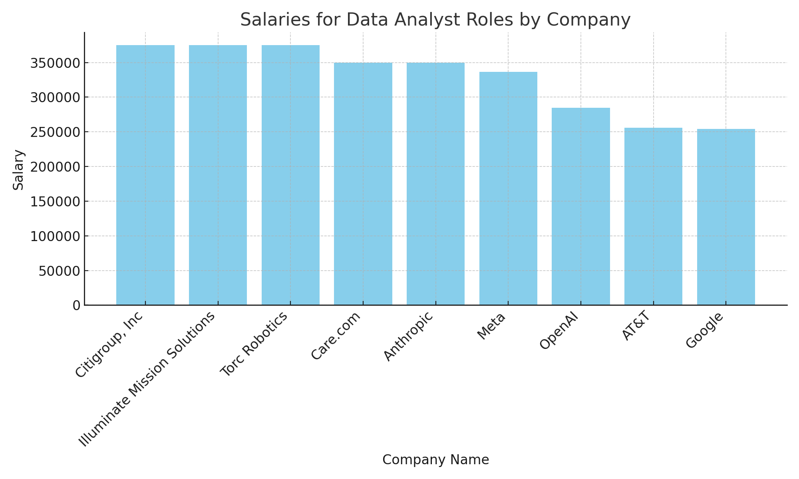
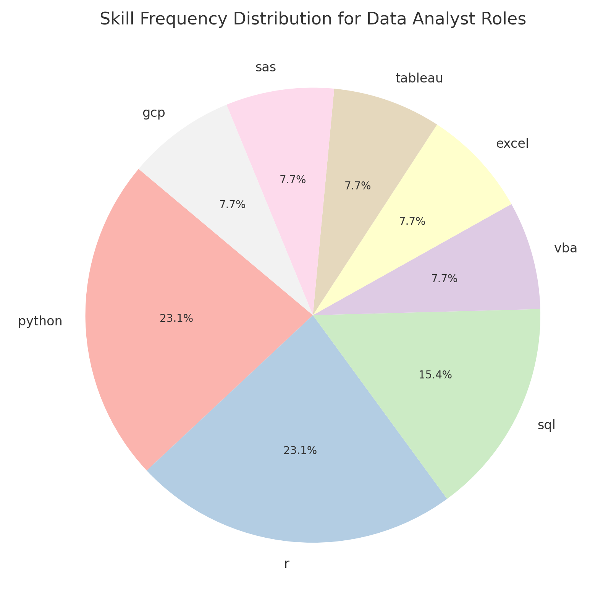
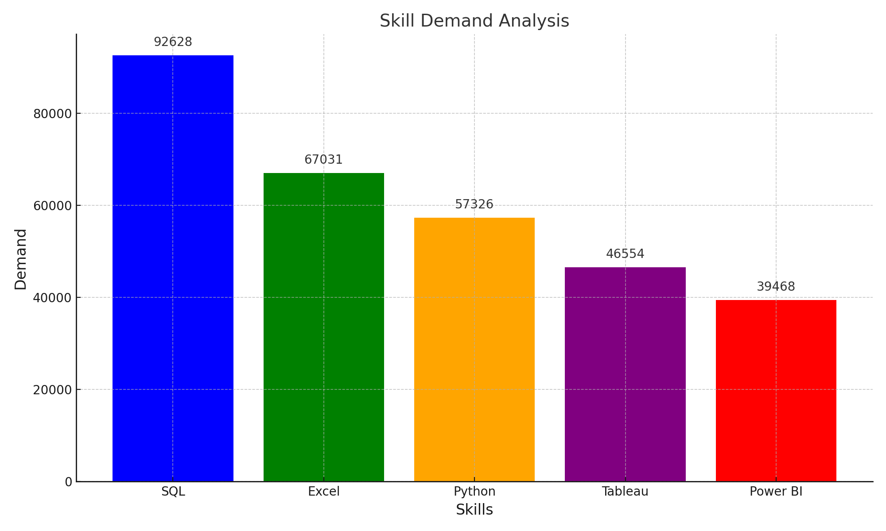
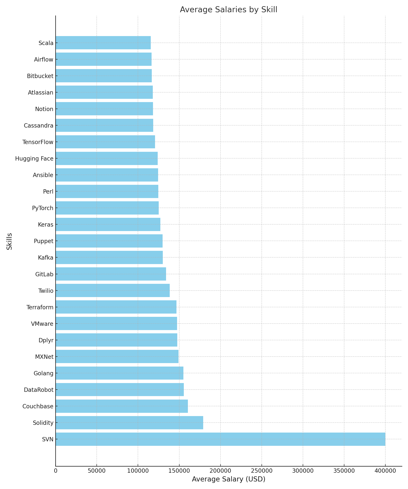

# Introduction
Dive into the data job market! Focusing on data analyst roles in **United States**, this project explores top-paying jobs, in-demand skills, and where high demand meets high salary in data analytics.

SQL queries? Check them out here: [Sql_query](/Sql_query/)

# Background
Driven by a quest to navigate the data analyst job market more effectively, this  project was born from a desire to pinpoint top-paid and in-demand skills, streamlining others work to find optimal jobs in **United States**.

Data hails from [Luke Barousse](https://www.lukebarousse.com/)

### The questions I wanted to answer through my SQL queries were:

1. What are the top-paying data analyst jobs?
2. What skillls are required for these top-paying  jobs?
3. What skills are most in demand for data analysts?
4. Which skills are associated with higher salaries?
5. What are the most optimal skills to learn?

# Tools I Used
For my deep dive into the data analyst job market, I harnessed the power of several key tools:

- **SQL**
- **PostgreSQL**
- **Visual Studio Code**
- **Git & GitHub**

# The Analysis
*These insights for only based on US job markets.!*
# 1.Top Paying Data Analyst jobs in United States:

```sql
Select job_id,
       job_title_short as job_roles,
       company_dim.name as company_name,
       job_country as location,
       job_posted_date,
       salary_year_avg as salary
From job_postings_fact
left join company_dim on job_postings_fact.company_id = company_dim.company_id
where job_country = 'United States' AND
      job_title_short = 'Data Analyst' AND
      salary_year_avg is not NULL
order by salary DESC
Limit 10;
```
Highest Salaries:
The top salary for a Data Analyst role is 375,000.0, shared by companies like:
- Citigroup, Inc
- Illuminate Mission Solutions
- Torc Robotics

Second-Highest Salaries:
The next tier salary is 350,000.0, offered by companies such as:
- Care.com
- Anthropic

The below chart is provide insights of Top10 paying data analyst jobs.




# 2.Skills required for these high paying jobs
```sql
With high_paying_skills as (
    Select job_id,
       job_title_short as job_roles,
       company_dim.name as company_name,
       job_country as location,
       job_posted_date,
       salary_year_avg as salary
    From job_postings_fact
    left join company_dim on job_postings_fact.company_id = company_dim.company_id
    where job_country = 'United States' AND
      job_title_short = 'Data Analyst' AND
      salary_year_avg is not NULL
    order by salary DESC
    Limit 10:
)

Select high_paying_skills.*,
       skills_dim.skills
From skills_job_dim
INNER JOIN skills_dim on skills_job_dim.skill_id = skills_dim.skill_id
INNER JOIN high_paying_skills on high_paying_skills.job_id = skills_job_dim.job_id
order by high_paying_skills.salary DESC

```
Top Skills:
The most frequently listed skills for Data Analyst roles in this dataset are evenly distributed across:
- Python
- R
- VBA
- GCP (Google Cloud Platform)



# 3.High Demand in Skills
```sql
Select skills_dim.skills,
       count(job_postings_fact.job_id) as demand
From job_postings_fact
Inner join skills_job_dim on job_postings_fact.job_id = skills_job_dim.job_id
Inner join skills_dim on skills_job_dim.skill_id = skills_dim.skill_id
where job_postings_fact.job_title_short = 'Data Analyst'
Group By skills_dim.skills
order by demand DESC
limit 5;
```
- SQL is the most sought-after skill, essential for data-related roles.
- Excel continues to be highly valued for reporting and data management.
- Python is crucial for advanced analytics, automation, and programming.
- Tableau and Power BI are vital tools for visualization and business intelligence.



# 4.High paying skills
```sql
Select skills_dim.skills,
       Round(avg(salary_year_avg),0) as Avg_salary
From job_postings_fact
Inner join skills_job_dim on job_postings_fact.job_id = skills_job_dim.job_id
Inner join skills_dim on skills_job_dim.skill_id = skills_dim.skill_id
where job_postings_fact.job_title_short = 'Data Analyst' AND
      salary_year_avg IS NOT NULL
Group By skills_dim.skills
order by Avg_salary DESC
limit 25;
```

High-Earning Skills:

SVN, Solidity, and Couchbase are among the top-paying skills, reflecting high demand and specialization.
Emerging tools like DataRobot and Golang also command significant salaries, signaling their importance in the industry.

Machine Learning Frameworks:

Skills in frameworks like Keras, PyTorch, TensorFlow, and Hugging Face are highly valued, indicating the growing need for expertise in AI/ML.

DevOps and Cloud Tools:

Terraform, VMware, Puppet, Ansible, and Kafka stand out in the DevOps ecosystem, with strong salary prospects for professionals.

Collaboration and Productivity Tools:

Notion, Atlassian, and Bitbucket highlight the importance of organizational tools for modern workflows.

Programming Languages:

GoLang, Scala, and Perl showcase demand for specific languages in specialized roles.



# 5.Optimal Skills(High paying and demand in skills)

```sql
Select skills_dim.skills,
       Count(job_postings_fact.job_id) as demand_count,
       Round(Avg(job_postings_fact.salary_year_avg),0) as salary
From job_postings_fact
Inner join skills_job_dim on job_postings_fact.job_id = skills_job_dim.job_id
Inner join skills_dim on skills_job_dim.skill_id = skills_dim.skill_id
where job_title_short = 'Data Analyst' AND
      job_country = 'United States' AND
      salary_year_avg IS NOT NULL 
Group by skills_dim.skills
having Count(job_postings_fact.job_id) > 10
Order by salary DESC,demand_count DESC
Limit 25;
```

There is a clear correlation between demand and salary for some skills like Spark and Airflow, which are both high in demand and offer competitive salaries.
Specialized skills like Perl, Kafka, and PyTorch command higher salaries despite lower demand, indicating their niche nature.

*The given below charts are high salary and high demand skills in optimal skills.Optimal skills means skills having both high demand and high salary*

**Top10 companies based on high salary**

.png)

**Top10 companies based on high demand**

.png)
# What I learned

Throughout this adventure, I've turbocharged my SQL toolkit with some serious firepower:

- **Complex Query Crafting:**Mastered the art of advanced SQL, merging tables like a pro and wielding WITH clauses for ninja-level temp table maneuvers.

- **Data Aggregation:**Got cazy with GROUP BY and turned aggregate functions like COUNT() and AVG() into my data-summarizing sidekicks.

- **Analytical Wizarding:**Leveled up my real-world puzzle-solving skills, turning questions into actionable, insightful SQL queries.

# Conclusions
This project enhanced my SQL skills and provided valuable insights into the data analyst job market. The findigs from the analysis serve as a guide to prioritizing skill development and job search efforts. Aspiring data analysts can better position themselves in a competitive job market by focusing on high_demand , high-salary skills. This exploration highlights the importance of continous learning and adaptation to emerging trends in the field of data analytics.


